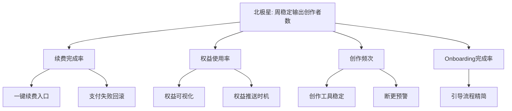

# 北极星指标完整示例 + 指标树

会员产品北极星指标完整示例。

## 业务游戏分类

| 游戏 | 特征 | 北极星方向 | 来源 |
|---|---|---|---|
| 注意力 | 用户停留即价值 | 日活时长/DAU | - |
| 交易 | 用户付费即价值 | GMV/付费订单 | - |
| **生产力** | **用户产出即价值** | **稳定输出次数** | PMContext 用户场景=高频创作者工具 |

会员产品 = 生产力游戏（用户用工具稳定产出）。

## 北极星指标 + Input Metrics 星座

```markdown
# 指标体系

## 北极星指标
**周稳定输出创作者数**：每周稳定输出 ≥3 次作品的付费创作者数
- 反映产品核心价值（稳定输出）← PMContext 价值验证度量
- 衡量用户体验价值（非虚荣指标）

## Input Metrics（3-5 个）
| Input Metric | 定义 | 对北极星的影响 | 来源 |
|---|---|---|---|
| 续费完成率 | 续费页完成支付的比例 | 续费失败→流失→停止输出 | PMContext 摩擦力 |
| 权益使用率 | 使用 ≥1 会员权益的创作者比例 | 权益不感知→不续费→停止输出 | PMContext [假设] |
| 创作频次 | 周均创作次数 | 频次高→价值感知强→续费→持续输出 | PMContext 用户场景 |
| Onboarding 完成率 | 新会员完成引导的比例 | 引导未完成→不会用权益→不续费 | PMContext [假设] |

## 七准则校验
| 准则 | 是否满足 | 说明 |
|---|---|---|
| 衡量核心价值 | ✓ | 稳定输出是产品核心价值 |
| 反映用户价值 | ✓ | 创作者稳定产出=用户获益 |
| 领先指标非滞后 | ✓ | 周稳定输出领先于续费 |
| 可度量可拆解 | ✓ | 可拆为续费率×权益使用×频次 |
| 团队可影响 | ✓ | 续费流程/权益设计可影响 |
| 简单一眼懂 | ✓ | "周稳定输出创作者数"清晰 |
| 非虚荣指标 | ✓ | 非DAU/注册数，反映真实价值 |
```

## 指标树 Mermaid


