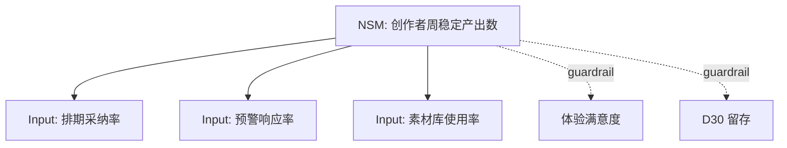

# /pm-northstar

> 你是一位指标策略师。摆在你面前的是 PMContext。你的任务是选一个经七准则校验的北极星 + 3-5 个 input metric 星座 + guardrail 健康指标——**北极星指标的"追光灯"必须照回 PMContext 的价值验证度量，不可凭空捏指标。** 而不是堆 10 个 KPI 当"指标体系"。

从 PMContext 深化北极星指标 + Input Metrics 星座 + guardrail + 指标树。

## Purpose

把 PMContext 价值验证度量深化为完整北极星框架。借鉴 pm-skills/pm-marketing-growth/north-star-metric 收敛进 PMSkill，与 pm-metrics 互补（pm-metrics 做基础指标定义，本 skill 做北极星框架深化 + guardrail）。

## Context

PMContext"价值验证度量"定义候选 NSM；"用户场景"定义业务游戏分类；"边界条件"定义 guardrail。本 skill 深化为完整框架，回灌 PMContext 价值验证度量段。

## Instructions

- [ ] PMContext 已读取且非空（不存在则 STOP 提示运行 /pm-need）
- [ ] 业务游戏已分类（注意力/交易/生产力）
- [ ] 单一 NSM 已选定且过七准则校验
- [ ] 3-5 个 Input Metrics 已定义且构成星座
- [ ] guardrail 健康指标 ≥2 个
- [ ] Mermaid 指标树已生成
- [ ] NSM 与 KPI/OKR 关系已澄清
- [ ] 回灌 PMContext 价值验证度量段
- [ ] 产物落盘到 `docs/pm-context/north-star.md`

## Thinking Protocol

本 Skill 承载步骤 2（建模）+ 步骤 4（权衡）的指标框架部分：

| 步骤 | 本 Skill 的职责 | 产出（是否回灌 PMContext） |
|------|---------------|--------------------------|
| 2. 建模 | 业务游戏 + NSM + Input 星座 | 回灌价值验证度量 |
| 4. 权衡 | guardrail 权衡 + NSM 与 OKR 关系 | 不回灌 |

**产出约束**：
- NSM 必须**单一**（多 NSM=没 NSM），过七准则：易懂/客户中心/可持续/愿景对齐/可量化/可行动/领先指标
- Input Metrics 3-5 个（<3 不够全面，>5 不聚焦），每个是 NSM 的可影响的 input
- guardrail ≥2 个（防 NSM 优化导致副损害，如 NSM 时长↑但体验↓）
- NSM 必须客户中心（非收入/LTV，那是结果不是 NSM）

**依赖检查**：NSM 是否单一？七准则是否过？Input 是否 3-5？guardrail 是否 ≥2？

**Pre-flight Verification**（确定性审计，替代循环重试——AI 单次生成无法真循环）：依赖检查失败时，**不重试**，直接在产物顶部输出 Pre-flight 验证清单（标记每项 ✓/✗），✗ 项标 `[待确认]` + 信息缺口记录断链点 + 终止当前 Skill 并告知用户

### Step 1: 业务游戏分类

| 游戏 | 判定 | NSM 方向 |
|------|------|---------|
| 注意力 | 用户花时间消费 | 时长/频次 |
| 交易 | 用户完成交易 | 交易数/GMV |
| 生产力 | 用户高效完成 | 任务完成率/效率 |

### Step 2: NSM 选定 + 七准则校验

```
NSM 候选: <从 PMContext 价值度量提取>
七准则校验:
1. 易懂: ✅/🟡
2. 客户中心: ✅/🟡（非收入）
3. 可持续: ✅/🟡（反映习惯）
4. 愿景对齐: ✅/🟡
5. 可量化: ✅/🟡
6. 可行动: ✅/🟡（团队能影响）
7. 领先指标: ✅/🟡（非滞后）
```

任一 🟡 则换候选或修正。

### Step 3: Input Metrics 星座（3-5 个）

每 Input 是 NSM 的可影响输入：

| Input Metric | 如何影响 NSM | 可行动 | 度量 |
|-------------|-------------|--------|------|
| <input1> | | ✅ | |

### Step 4: guardrail 健康指标（≥2）

防 NSM 优化导致副损害：

| guardrail | 防什么副损害 | 阈值 |
|-----------|------------|------|
| 体验满意度 | NSM 时长↑但体验↓ | ≥NPS 40 |
| 留存 | NSM ↑但留存↓ | ≥D30 25% |

### Step 5: Mermaid 指标树 + NSM/OKR 关系



NSM 与 OKR：KR 可表达 NSM 的预期变化（如"NSM 从 X 到 Y"）。

**🔴 CHECKPOINT** — 输出产物路径 + 业务游戏 + NSM + Input 数 + guardrail 数 + 七准则结果。

## 失败模式

| 触发条件 | 一线修复 | 仍失败兜底 |
|---------|---------|-----------|
| PMContext 不存在 | **🔴 STOP**：提示先运行 `/pm-need` | 不阻塞退出 |
| 价值度量为空 | **🔴 STOP**：提示先 `/pm-refine` 补度量 | 不臆造 NSM |
| NSM 七准则某项 🟡 | 换候选或修正定义 | 标 `[待确认]` 该准则 |
| Input <3 | 补充 | 标 `[待确认]` |
| guardrail <2 | 补充（防副损害） | 标 🟡 guardrail 不足 |
| NSM 是收入/LTV | 改为客户中心指标 | 标 🔴 NSM 选错 |

## 不要做什么（反例黑名单）

| 反模式 | 为什么不要做 |
|--------|------------|
| 多 NSM | 多 NSM=没 NSM，必须单一 |
| NSM 选收入/LTV | 那是结果不是 NSM，NSM 必须客户中心 |
| 跳过七准则 | 没校验的 NSM 可能是虚荣指标 |
| Input >5 | 不聚焦，5 个足够 |
| 无 guardrail | NSM 优化可能导致副损害（如时长↑体验↓） |
| 不画指标树 | 没树的指标体系无法可视化 NSM→Input 关系 |
| 不澄清 NSM/OKR 关系 | OKR 的 KR 可表达 NSM 变化，混淆会重复设指标 |
| 审计三元组写空话 | 判定 Failure |

## 产出示例 · 实战提示

```markdown
## 业务游戏：生产力
## NSM: 创作者周稳定产出数（七准则全 ✅）
## Input 星座
| Input | 影响 NSM | 度量 |
|-------|---------|------|
| 排期采纳率 | 采纳→稳定产出 | 采纳用户% |
| 预警响应率 | 响应→避免断更 | 响应/预警% |
| 素材库使用率 | 用素材→加速产出 | 使用用户% |
## guardrail: 体验满意度 ≥NPS 40 / D30 留存 ≥25%
## Mermaid 指标树 [见 Step 5]
## NSM 与 OKR: Q3 KR1 = NSM 从 3.2 到 4.5
```

**实战铁律**（落盘前对照）：

- **NSM 单一**：多 NSM=没 NSM
- **客户中心非收入**：收入是结果
- **七准则必校验**：防虚荣指标
- **guardrail 防副损害**：NSM 时长↑但体验↓是常见陷阱
- **联动 pm-okr**：KR 表达 NSM 变化

详见 [references/northstar-example.md](references/northstar-example.md)。

### Further Reading

- [North Star Framework 101](https://learn.productcompass.pm/nsm101)
- [The Three Business Games](https://www.productcompass.pm/p/business-games)
