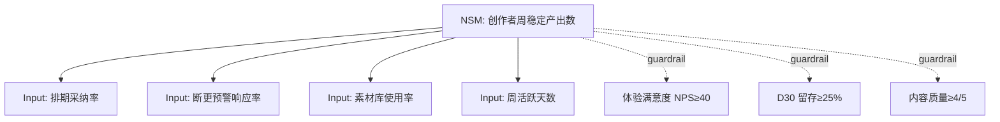

# 北极星指标深化完整示例

## 场景

会员产品从 PMContext 价值度量深化北极星框架。

## 业务游戏分类

**生产力游戏**（用户用产品高效完成创作任务）→ NSM 方向：任务完成率/效率提升

## NSM 选定 + 七准则校验

```
NSM: 创作者周稳定产出数（每周稳定产出≥3 篇内容的创作者数）
```

| 准则 | 校验 | 结果 |
|------|------|------|
| 1. 易懂 | "周稳定产出数"一句话讲清 | ✅ |
| 2. 客户中心 | 衡量客户获得价值（稳定产出）非收入 | ✅ |
| 3. 可持续 | 反映习惯（周复访）非一次性 | ✅ |
| 4. 愿景对齐 | "让创作者稳定高效产出"（PMContext 用户场景） | ✅ |
| 5. 可量化 | 可数（周产出≥3 篇的创作者数） | ✅ |
| 6. 可行动 | 团队能影响（排期/预警/素材库→稳定产出） | ✅ |
| 7. 领先指标 | 领先于收入（先稳定产出→后付费留存） | ✅ |

七准则全 ✅ → NSM 确认。

## Input Metrics 星座（3-5 个）

| Input Metric | 如何影响 NSM | 可行动 | 度量 |
|-------------|-------------|--------|------|
| 排期采纳率 | 采纳排期→按计划产出→稳定 | ✅（优化排期 UI） | 采纳排期的用户% |
| 断更预警响应率 | 响应预警→避免断更→稳定 | ✅（优化预警时机） | 响应/预警% |
| 素材库使用率 | 用素材→加速产出→稳定 | ✅（扩充素材库） | 使用素材的用户% |
| 周活跃天数 | 活跃→产出→稳定 | ✅（提升粘性） | 周活跃≥4 天的用户% |

## guardrail 健康指标（≥2）

| guardrail | 防什么副损害 | 阈值 |
|-----------|------------|------|
| 体验满意度（NPS） | NSM↑但体验↓（如过度推送预警） | ≥NPS 40 |
| D30 留存 | NSM↑但留存↓（如刷量产出） | ≥D30 25% |
| 内容质量评分 | NSM↑但质量↓（如低质高产） | ≥4/5 分 |

## Mermaid 指标树



## NSM 与 KPI/OKR 关系澄清

| 概念 | 定义 | 本框架关系 |
|------|------|----------|
| NSM | 单一客户中心北极星 | 创作者周稳定产出数 |
| Input Metrics | NSM 的可影响输入 | 4 个 Input（排期/预警/素材/活跃） |
| guardrail | 防副损害的健康指标 | 3 个 guardrail（NPS/留存/质量） |
| KPI | 长期跟踪指标 | NSM + guardrail 都是 KPI |
| OKR KR | 季度定量进展 | Q3 KR1 = NSM 从 3.2 到 4.5（联动 pm-okr） |

## 回灌 PMContext

NSM + Input 星座 + guardrail 回灌 PMContext 价值验证度量段，替换原有零散度量定义。

## 审计三元组

`<依据集: [PMContext 价值验证度量+用户场景"创作者高效产出"]> → [工具: /pm-northstar, 规则: 业务游戏+七准则+Input 星座+guardrail] → [转换: 从价值度量推导 NSM 候选，七准则校验筛选，同义词推导：PM 说"稳定产出"→映射 NSM"周稳定产出数"] → <产出: 生产力游戏+NSM+4 Input+3 guardrail+Mermaid 树+OKR 关系>`
