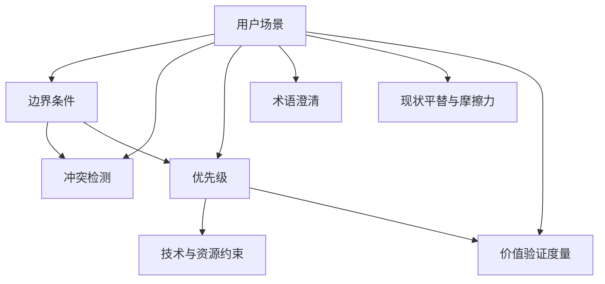

# 决策依赖树示例与建树技巧

> 本文件是 `/pm-refine` 追问模式 Step 0 的 Level 3 渐进披露资源。展示完整决策依赖树建树 + 拓扑遍历顺序 + glossary 随问随记示例。

## 示例输入材料

会员体系重构 collect 产物（8 维推断前已扫完）：

```
- 对话: 续费率 QoQ -12%，NPS 从 32 跌到 18，用户反馈"续费太麻烦"
- 项目扫描: 代码仅月付逻辑，无提醒模块，pay/ 含微信+支付宝
- 知识库: 会员规则.md（三级权益定义），竞品分析.pdf（Ofo 已推年付）
- 盾: 销售反馈"年付含线下活动" vs 运营反馈"不含，成本过高"
```

## Step 0: 建决策依赖树

### 材料覆写后的依赖骨架

Agent 扫 8 维，根据材料覆写默认骨架：

| 维度 | 优先级 | 依赖前件 | 覆写依据 |
|------|--------|---------|---------|
| 用户场景 | P0 | 无 | 推断起点 |
| 边界条件 | P0 | 用户场景 | 默认骨架 |
| 冲突检测 | P0 | 用户场景 + 边界条件 | 材料含"年付含线下活动"冲突，需场景与边界先立才能定 |
| 优先级 | P1 | 用户场景 + 边界条件 | 默认骨架 |
| 术语澄清 | P1 | 用户场景 | 默认骨架（"线下活动"是否含权益术语需场景上下文） |
| 现状平替与摩擦力 | P1 | 用户场景 | 默认骨架（平替是为同一场景服务的土办法） |
| 技术与资源约束 | P2 | 优先级 | 默认骨架（做什么不做什么决定技术选型） |
| 价值验证度量 | P2 | 用户场景 + 优先级 | 默认骨架（度量映射场景核心动作与优先级覆盖功能） |

### Mermaid 树状图



### 拓扑遍历序

```
1. 用户场景（无前件）
2. 边界条件（前件：用户场景）
3. 现状平替与摩擦力（前件：用户场景；同层无依赖，与边界条件谁先都可）
4. 冲突检测（前件：用户场景 + 边界条件）
5. 优先级（前件：用户场景 + 边界条件）
6. 术语澄清（前件：用户场景）
7. 价值验证度量（前件：用户场景 + 优先级）
8. 技术与资源约束（前件：优先级）
```

**🔴 不按 P0→P1→P2 固定序问**——本拓扑序把"冲突检测"放第 4（依赖前件确认后），把"优先级"放第 5，把"术语澄清"放第 6（P1 但依赖场景已在前几步确认）。固定 P0→P1→P2 序会让优先级在边界条件未定时被问，PM 被迫瞎答。

### 落盘文件 `process/02-refine-deps-tree.md`

```markdown
# 决策依赖树 — 会员体系重构

> 生成于 /pm-refine 追问模式 Step 0 | 基于材料覆写默认骨架

## 依赖骨架

| 维度 | 优先级 | 依赖前件 | 覆写依据 |
|------|--------|---------|---------|
| ... | ... | ... | ... |

## 树状图

（Mermaid graph TD）

## 拓扑遍历序

1. 用户场景
2. 边界条件
3. 现状平替与摩擦力
4. 冲突检测
5. 优先级
6. 术语澄清
7. 价值验证度量
8. 技术与资源约束
```

## Step 0 后的追问示例（按拓扑序）

```
Agent: 关于"用户场景"，从材料推断主要有两类用户：月付会员和年付潜在用户。
推荐: 月付会员为核心用户群，占 80% | 依据: 材料M1用户分布数据 | 备选: 企业客户（来自材料M3的API调用记录）

PM: 对

→ 用户场景确认，下游分支解锁边界条件/现状平替/术语澄清

Agent: 关于"边界条件"——续费失败时的异常路径，从代码扫到无提醒模块。
推荐: 续费失败走人工补提醒（邮件） | 依据: 项目扫描pay/无提醒模块 | 备选: 自动续费失败即降级为免费用户

PM: 选B，失败就降级

→ 边界条件确认，冲突检测分支解锁

Agent: 关于"冲突检测"——销售说年付含线下活动，运营说不含。边界条件已确认为"失败降级"。
推荐: 含权益（按销售反馈，权益变更触发续费意愿） | 依据: 销售反馈+续费率相关性 | 备选: 不含（按运营，成本控制）

PM: 都不是，权益含但需另付费

→ 采信"含但另付费"，标事实，来源记 ← 对话: PM 确认；冲突消解
```

## glossary 随问随记示例

追问过程中当"术语澄清"维度或其它维度出现新术语，同步追加到 `process/02-refine-glossary.md`：

```markdown
# 术语沉淀 — 会员体系重构

> 生成于 /pm-refine 追问模式 | 边问边记，只记 PM 已确认的术语 | 落盘路径: docs/pm-context/process/02-refine-glossary.md

| 术语 | Definition（PM 确认版） | 来源锚点 | 状态 |
|------|-------------------------|---------|------|
| 月付会员 | 当前唯一付费档位，权益=广告去除+高清播放 | `pm-context.md#会员权益` | 事实（PM 确认） |
| 年付潜在用户 | 有年付意愿但当前无档位可选的用户群 | `pm-context.md#概述` | 事实（PM 确认） |
| 失败降级 | 续费失败自动降为免费用户，无人工补提醒 | `pm-context.md#会员权益/规则` | 事实（PM 确认） |
| 线下活动权益 | 含但需另付费，非年付档位自带 | `pm-context.md#冲突检测` | 事实（PM 确认，消解冲突） |
| NRR | Net Retention Revenue，净留存收入——[假设]续费率替代指标 | `pm-context.md#价值验证度量` | [待确认]（度量维度未问到，推断预填） |
```

**与 PMContext §7 术语澄清段的关系**：
- glossary 是**过程沉淀**——含推断痕迹（NRR 标 `[待确认]` 是度量维度未问时预填），可审计追问是怎么走的
- PMContext §7 是**终态沉淀**——只含最终采信版，推断痕迹不进 §7
- glossary 走 `process/` 进版本库可审计追溯，§7 走 `pm-context.md` 是下游 View 读取的唯一源
- 两者不重复——glossary 虚量更大（含推断 + PM 确认），§7 是 glossary 的"采信子集"

## 建树技巧

| 技巧 | 说明 |
|------|------|
| 材料覆写默认骨架 | 默认骨架是兜底，材料已含显式依赖关系时必须按材料覆写。如材料说"技术选型已定"则技术约束维度无依赖前件 |
| 同层维度任意序 | 无依赖的同层维度（如边界条件与现状平替）谁先问都可，Agent 按材料置信度选——置信度高的先问 |
| 前件未定时走下游 | 前件标 `[待确认]` 或 `[冲突]` 时下游照走，但标"前置未定，推断置信度受限"——不阻塞追问链 |
| PM 中途退出按机制处理 | PM 说"停"时已问维度落盘，未问维度标 `[待确认]`。依赖树中下游因前件未问也一并标 `[待确认]` |
| 重跑增量时覆写骨架 | 增量更新重跑时先扫新材料覆写依赖骨架，可能改变拓扑序——如新材料让某维度前件已确认，该维度可提前问 |

## 避坑提示

| 坑 | 怎么避 |
|----|--------|
| 固定按 P0→P1→P2 问 | 拓扑遍历是核心，固定顺序会让下游维度在缺前置信息时被问 |
| 依赖树不落盘 | 必须落 `process/02-refine-deps-tree.md`，重跑时可比对骨架变化审计 |
| glossary 记推断术语 | 只记 PM 已确认的，未问到的术语标 `[待确认]` 但不臆造 Definition |
| glossary 与 §7 内容相同 | glossary 含推断痕迹，§7 是采信子集，两者虚量不同 |
| 前件未定就问下游 | 前件未确认走下游时必须标"前置未定，置信度受限"，不可假装前件已定 |
```
