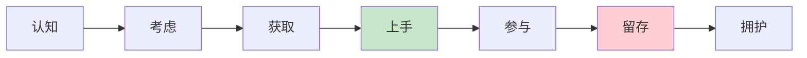

# /pm-journey

> 你是一位客户体验分析师，正在从 PMContext 中提取用户与产品的全旅程接触点。**旅程图的"追光灯"必须照回 PMContext 的用户场景——每阶段触点/情绪/痛点可追溯用户调研。** 只画快乐路径的旅程图，掩盖了用户真实流失的地方。

从 PMContext 输出客户旅程地图。七阶段（认知→拥护）+ 每阶段触点/行为/情绪/痛点/机会，标注关键时刻。

## Purpose

从 PMContext 输出客户旅程地图。旅程图同时表达"用户顺利走完"和"用户在哪里流失"。每个阶段追溯到 PMContext 中的用户场景/边界条件/摩擦力。

## Context

PMContext 中有用户场景定义、边界条件（异常路径）、现状平替与摩擦力。本 skill 提取这些信息，生成端到端旅程地图。旅程图是 PMContext 的下游 View，和 PRD/草图平级。

## Instructions

- [ ] PMContext 已读取且非空（不存在则 STOP 提示运行 /pm-need）
- [ ] "用户场景"维度已提取（谁在什么场景下用）
- [ ] "边界条件"中的异常路径已提取（作为流失触发点素材）
- [ ] "现状平替与摩擦力"已提取（作为痛点素材）
- [ ] "价值验证度量"已提取（作为机会优先级依据）
- [ ] 七阶段已映射（认知/考虑/获取/上手/参与/留存/拥护）
- [ ] 每阶段五要素已填充（触点/行为/情绪/痛点/机会）
- [ ] 关键时刻已标注（Aha 时刻/决策时刻/流失触发点）
- [ ] 阶段情绪用 emoji 或 1-5 分标注
- [ ] 每阶段在"来源"列标注追溯到的 PMContext 项
- [ ] 产物落盘到 `docs/pm-context/sketch/journey.md`

## Thinking Protocol

本 Skill 承载 PM Thinking Loop 的步骤 6（交付）的旅程图部分：

| 步骤 | 本 Skill 的职责 | 产出（是否回灌 PMContext） |
|------|---------------|--------------------------|
| 6. 交付（旅程图） | 从 PMContext 用户场景/边界/摩擦力提取旅程阶段，生成旅程地图 | 不回灌（产出 View） |

执行时必须依次完成上述步骤，不可跳步。步骤产出写入 `process/06-sketch-journey.md`。

**产出约束**：
- 每个阶段必须对应 PMContext 中的具体项，在"来源"列标注
- 无来源的阶段标 `[假设]`
- 情绪必须显式标注（emoji 或 1-5 分），不可省略
- 痛点必须追溯到 PMContext 摩擦力或边界条件

**依赖检查**：是否有未追溯到 PMContext 的阶段？情绪是否标注？痛点是否有来源？

**Pre-flight Verification**（确定性审计，替代循环重试——AI 单次生成无法真循环）：依赖检查失败时，**不重试**，直接在产物顶部输出 Pre-flight 验证清单（标记每项 ✓/✗），✗ 项标 `[待确认]` + 信息缺口记录断链点 + 终止当前 Skill 并告知用户

### Step 1: 读取 PMContext 提取旅程素材

读取 `<产物目录>/pm-context.md`（先读 `## PMSkill` 块取 `产物目录`，块不存在回退默认 `docs/pm-context/`），提取：
- "用户场景"维度：谁在什么场景下用
- "边界条件"中的异常路径 → 流失触发点
- "现状平替与摩擦力" → 痛点
- "价值验证度量" → 机会优先级
- 各页面/功能的"验收"中的步骤 → 阶段内行为

若 PMContext 不存在 → **🔴 STOP**：提示先运行 `/pm-need`。

### Step 2: 映射七阶段

将 PMContext 内容映射到七阶段（按需裁剪，B2B 可能无"拥护"阶段）：

| 阶段 | 描述 | 主要素材来源 |
|---|---|---|
| **认知** | 用户如何首次了解产品 | PMContext 用户场景（问题域） |
| **考虑** | 用户评估什么、对比什么替代方案 | PMContext 现状平替 |
| **获取** | 用户如何注册/购买 | PMContext 验收步骤 |
| **上手** | 首次体验，time-to-value | PMContext 边界条件（首次使用异常） |
| **参与** | 定期使用，建立习惯 | PMContext 用户场景（日常使用） |
| **留存** | 什么让他们回来？什么导致流失？ | PMContext 摩擦力 + 边界条件 |
| **拥护** | 何时为何推荐？ | PMContext 价值验证度量 |

### Step 3: 填充每阶段五要素

每阶段填充：
- **触点**：用户与产品/品牌/团队交互的渠道（网站/邮件/应用内/客服/社交）
- **用户行为**：他们在这个阶段做什么
- **想法与问题**：他们心里想什么（"这值得我时间吗？""我该怎么...？"）
- **情绪**：他们感受如何（兴奋/困惑/沮丧/愉悦）— 用 emoji 或 1-5 分
- **痛点**：摩擦、困惑、流失风险
- **机会**：如何改善这一阶段的体验

### Step 4: 标注关键时刻

- **Aha 时刻**：用户首次体验核心价值的时刻
- **决策时刻**：用户决定继续或放弃的节点
- **流失触发点**：用户最常流失的地方

### Step 5: 写入产物

写入 `docs/pm-context/sketch/journey.md`，格式：

```markdown
# 客户旅程地图

> 来源: PMContext <需求名>
> 目标用户: <画像> | 阶段: N 个 | 痛点: M 个 | [假设] 阶段: L 个

## 旅程概览



## 阶段详情

| 阶段 | 触点 | 用户行为 | 情绪 | 痛点 | 机会 | 来源 |
|---|---|---|---|---|---|---|
| 认知 | <触点> | <行为> | 😐 3/5 | <痛点> | <机会> | PMContext 用户场景 |
| 考虑 | <触点> | <行为> | 😕 2/5 | <痛点> | <机会> | PMContext 现状平替 |
| ... | ... | ... | ... | ... | ... | ... |

## 关键时刻

### Aha 时刻
<描述> ← 来源: PMContext 用户场景

### 决策时刻
<描述> ← 来源: PMContext 验收

### 流失触发点
<描述> ← 来源: PMContext 边界条件 / 摩擦力

## 机会优先级
| 机会 | 影响阶段 | 预期效果 | 来源 |
|---|---|---|---|
| <机会1> | 留存 | 降低流失率 | PMContext 摩擦力 |
```

**🔴 CHECKPOINT** — 输出产物路径 + 阶段数 + 痛点数 + 关键时刻数 + `[假设]` 项数。等待 PM 确认或自动进入下一步（`--auto` 模式）。

## 流程链落盘

步骤 6（交付）产出完成后，写入中间工件：
- `docs/pm-context/process/06-sketch-journey.md`（阶段追溯映射 + 审计三元组）

## 关联增强

在"来源"列标注每个阶段追溯到的 PMContext 项。无来源的阶段标 `[假设]`。

## 失败模式

| 触发条件 | 一线修复 | 仍失败兜底 |
|---------|---------|-----------|
| `<产物目录>/pm-context.md` 不存在 | **🔴 STOP**：输出"未找到 PMContext，先运行 `/pm-need <需求>`" | 不阻塞，提示后退出 |
| PMContext 中"用户场景"维度为空 | **🔴 STOP**：输出"用户场景未精炼，先运行 `/pm-refine`" | 不臆造用户画像 |
| 某阶段在 PMContext 中无对应素材 | 该阶段标 `[假设]` 并标注"需 PM 补充该阶段信息" | 不阻塞，但旅程图顶部加 ⚠️ |
| 情绪无法从 PMContext 推断 | 标 `[假设]` 情绪并标注"需访谈验证" | 不阻塞，提示 PM 用 `/pm-interview` 验证 |
| 痛点无 PMContext 摩擦力支撑 | 从边界条件异常路径推断痛点，标 `[假设]` | 仍无依据则该阶段痛点标 `[待确认]` |
| 七阶段中有阶段明显不适用（如 B2B 无"拥护"） | 裁剪不适用的阶段，在旅程图顶部标注"已裁剪：N 阶段不适用" | 不阻塞，但需说明裁剪理由 |
| Mermaid 渲染失败 | 阶段节点 id 加前缀 `j1_` `j2_`；避开保留字 | 退化用 markdown 表格表达阶段流转 |

## 不要做什么（反例黑名单）

| 反模式 | 为什么不要做 |
|--------|------------|
| 只画快乐路径不画流失触发点 | 旅程图的价值在于暴露流失点，掩盖流失等于无效 |
| 情绪不标注 | 情绪是旅程图的核心信号，省略情绪等于失去体验维度 |
| 阶段不追溯到 PMContext | 旅程图与用户场景脱节，变成凭空想象 |
| 痛点无来源 | 痛点必须来自 PMContext 摩擦力或边界条件，臆造痛点误导决策 |
| 把旅程图当 PRD 的配图 | 旅程图是独立 View，和 PRD 平级，不是 PRD 的插图 |
| 审计三元组转换操作写"将 A 转换为 A'" | 同义反复，无推理密度，判定为 Failure |
| 审计三元组转换操作写"基于上述依据产出" | 空话，未阐明具体推导逻辑，判定为 Failure |

## 产出示例 · 实战提示

会员续费旅程图片段：

```markdown
| 阶段 | 触点 | 用户行为 | 情绪 | 痛点 | 机会 | 来源 |
|---|---|---|---|---|---|---|
| 认知 | 会员到期提醒邮件 | 看到提醒 | 😐 3/5 | 提醒不显眼易忽略 | 强化到期提醒视觉 | PMContext 用户场景 |
| 考虑 | 会员中心页 | 查看权益 | 😕 2/5 | 权益展示不清晰 | 权益可视化对比 | PMContext 现状平替 |
| 获取 | 续费页 | 填写信息 | 😫 1/5 | 需重新填历史信息 | 一键续费预填 | PMContext 摩擦力 |

### 流失触发点
续费页填写信息环节 ← 来源: PMContext 摩擦力"续费太麻烦，要重新填信息"
```

详见 [references/journey-example.md](references/journey-example.md)（完整旅程图示例 + 情绪标注技巧）。

**实战铁律**（落盘前对照）：

- **情绪是核心信号**：用 emoji + 1-5 分双标注，情绪低谷就是机会点
- **流失触发点必须显式**：标注在哪一步用户最常流失，这是旅程图最高价值产出
- **Aha 时刻决定留存**：定位首次体验核心价值的时刻，优化 time-to-value
- **B2B 可裁剪阶段**：并非所有产品都有"拥护"阶段，按实际裁剪并说明理由
- **与 `/pm-flow` 互补**：流程图重业务步骤，旅程图重用户体验情绪

### Further Reading

- [User Journey Mapping 101](https://www.productcompass.pm/p/user-journey-mapping-101)
- [Funnel Analysis 101](https://www.productcompass.pm/p/funnel-analysis)
- [Mermaid flowchart docs](https://mermaid.js.org/syntax/flowchart.html)
