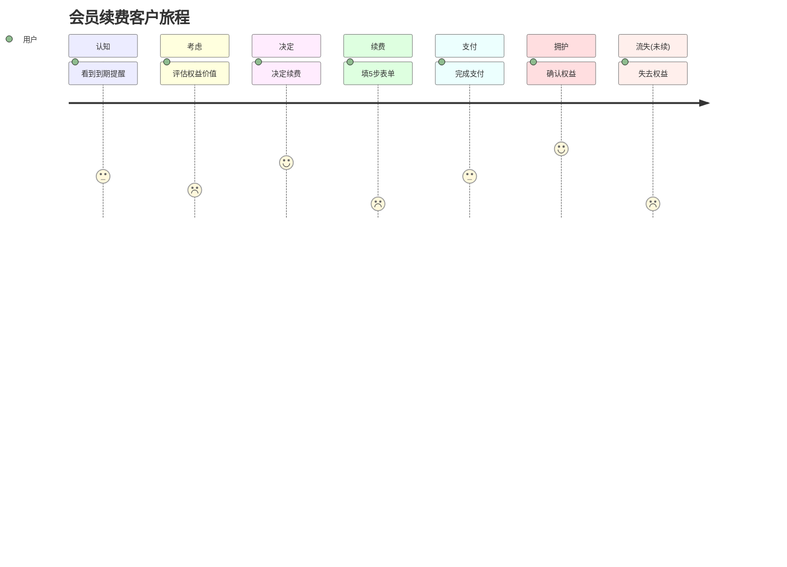

# 客户旅程地图完整示例

会员续费客户旅程（七阶段）完整示例。

## 旅程总览

```markdown
# 客户旅程地图: 会员续费

> 来源: PMContext 会员续费
> 阶段: 7 个 | 触点: N 个 | Aha 时刻: 1 | 关键时刻: 2 | 流失触发点: 1

## 七阶段表
| 阶段 | 触点 | 行为 | 情绪 | 痛点 | 机会 | 来源 |
|---|---|---|---|---|---|---|
| 认知 | 会员到期提醒推送 | 看到提醒 | 中性 | 提醒易忽略 | 多渠道提醒 | PMContext 用户场景 |
| 考虑 | 续费页 | 评估是否续 | 犹豫 | 权益价值不清 | 权益可视化 | PMContext [假设] |
| 决定 | 续费按钮 | 决定续费 | 决心 | - | - | PMContext 用户场景 |
| 续费 | 续费表单(5步) | 填写信息 | 挫败↓ | 重新填信息太麻烦 | 一键续费 | PMContext 摩擦力 |
| 支付 | 支付页 | 完成支付 | 紧张 | 支付失败无回滚 | 失败回滚 | PMContext 边界条件 |
| 拥护 | 续费成功页 | 确认权益 | 满足↑ | - | 续费仪式感 | PMContext 价值验证度量 |
| 流失 | (未续费)到期降级 | 失去权益 | 失落↓ | 流失后挽回难 | 流失前预警 | PMContext [假设] |
```

## Mermaid 旅程图



## 关键节点标注

- **Aha 时刻**：拥护阶段"确认权益"——用户首次清晰感知会员价值，决定下次主动续费
- **关键时刻 1**：续费阶段"填5步表单"——情绪最低点，流失集中触发
- **关键时刻 2**：支付阶段"支付失败无回滚"——信任断裂点
- **流失触发点**：续费阶段挫败情绪累积 → 放弃续费 → 流失阶段

## 情绪曲线解读

情绪在"续费表单"跌至最低(1)，在"确认权益"升至最高(5)。优化重点：拉高续费阶段情绪（一键续费将其从 1 提至预期 4）。
