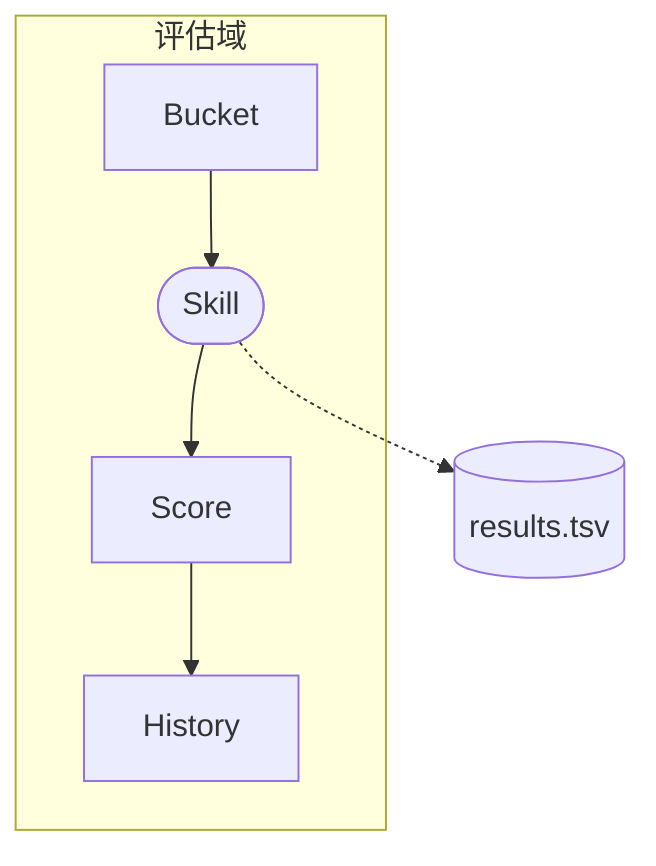
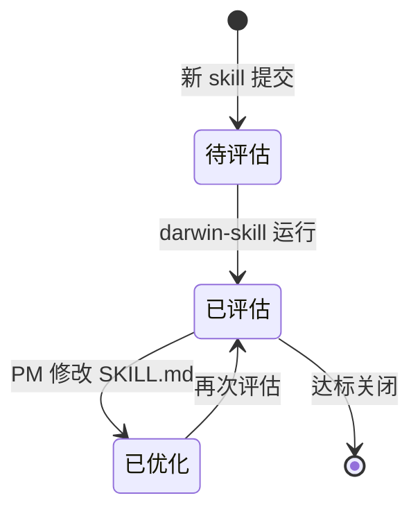

# 草图 + HTML 原型联动产出示例

> 本文件是 `/pm-sketch` 的 Level 3 渐进披露资源。展示从 PMContext 到 4 类草图 + HTML 原型的完整产出，覆盖简单模式和复杂模式。

---

## 示例一：简单模式（单 HTML）

### 输入：PMContext 片段（质量看板）

```
# PMContext: Skill 质量看板

## 概述
### 问题与目标
PMSkill 项目中散落着 13 个 SKILL.md，PM 无法直观了解每个 skill 的质量水平。

## 用户场景
### 事实
- PM 是每天使用 PMSkill 的产品经理
- 场景：PM 需要知道"我的 skill 质量怎么样"
### 规则
- 看板必须从所有 `skills/*/SKILL.md` 读取数据
- 评分必须使用 darwin-skill 的 9 维 rubric（d1-d9）

## 全局约束
| 约束 | 说明 |
|------|------|
| 数据源 | results.tsv |
| 展示格式 | HTML 页面，嵌入 git 仓库直接访问 |
| 无需后端 | 纯前端方案 |
```

### 复杂度判断

| 维度 | 信号 | 结果 |
|------|------|------|
| 页面 heading 数 | 3（概述、用户场景、全局约束 + 决策日志/假设清单） | 简单信号 |
| 数据模型章节 | 有，但较短 | 简单信号 |
| 用户角色数 | 1（PM） | 简单信号 |
| state.md 节点数 | — | 未生成 |
| **结论** | **简单模式 → prototype.html** | |

### 产出物清单（`--prototype` 模式）

```
docs/pm-context/sketch/
├── ia.md           # 信息架构：Skill/Score/Bucket 实体关系
├── state.md        # 状态机：待评估→已评估→已优化
├── flow.md         # 质量评估流程：选择 skill→评分→查看短板
├── wireframe.md    # 线框：3 页布局表格
└── prototype.html  # 高保真交互原型（单页 HTML，< 280KB，含 Device Toolbar + PRD Panel）
```

### 信息架构图（ia.md 片段）



### 状态机（state.md 片段）



### HTML 原型特性（prototype.html）

- ✅ Device Toolbar：Desktop（1440px）/ Tablet（820px）/ Mobile（393px）三端切换
- ✅ PRD Panel：展示 PMContext 事实、规则、验收条目的侧边栏
- ✅ Design Token：所有颜色通过 CSS 变量引用，无裸 `#hex`
- ✅ 每个页面 `<section>` 含至少 1 个 JS 交互事件
- ✅ 暗色主题适配（跟随系统或 `--dark` 参数）
- ✅ 文件大小 < 280KB

---

## 示例二：复杂模式（bundle 文件夹）

### 输入：PMContext 片段（企业采购管理系统）

```
# PMContext: 企业级采购管理系统

## 概述
（5 个采购相关页面 + 数据模型段 + 多个用户角色）

## 采购需求管理
### 事实: 需求来源包括手工录入/Excel 导入/MRP 推送
### 规则: 采购金额 ≥50000 元需 3 家比价

## 供应商管理
### 事实: 供应商状态 潜在→考察中→合格→暂停→黑名单
### 规则: 评分连续 2 次 <60 分自动降级

## 采购订单管理
### 事实: PO 可拆单、支持 ECN 变更
### 规则: ECN 累加 >20% 需重新审批

## 收货与质检
### 事实: 电子料 100% 质检，包材 AQL=0.65 抽检

## 对账与付款
### 事实: 三单匹配（PO+收货+发票）后发起付款

## 数据模型
### 核心实体关系: Department-User-PR-PO-Supplier...
```

### 复杂度判断

| 维度 | 信号 | 结果 |
|------|------|------|
| 页面 heading 数 | 6（采购需求/供应商/PO/收货/对账/用户管理） | **复杂信号** |
| 数据模型章节 | 有独立「数据模型」段，含 7 个实体关系 | **复杂信号** |
| 用户角色数 | 5（采购员/需求人/财务/老板/供应商） | **复杂信号** |
| **结论** | **复杂模式 → prototype/ 文件夹** | |

### 产出物清单（`--prototype` 模式）

```
docs/pm-context/sketch/
├── ia.md                   # 信息架构
├── state.md                # 状态机
├── flow.md                 # 流程图
├── wireframe.md            # 线框
└── prototype/              # 复杂模式 bundle
    ├── index.html          # 入口壳（< 30KB）
    ├── app.js              # 完整交互逻辑
    ├── styles.css          # Design Token + 响应式
    ├── prd-data.js         # PMContext 批注数据注入
    ├── mock-data.js        # 图表/列表 Mock 数据
    └── README.md           # 本地启动说明
```

### prototype/index.html 入口壳

```html
<!DOCTYPE html>
<html lang="zh-CN">
<head>
  <meta charset="UTF-8">
  <meta name="viewport" content="width=device-width, initial-scale=1.0">
  <title>原型: 企业采购管理系统</title>
  <link rel="stylesheet" href="styles.css">
</head>
<body>
  <div id="app">
    <nav id="nav-bar"></nav>
    <main id="page-content"></main>
  </div>
  <script src="prd-data.js"></script>
  <script src="mock-data.js"></script>
  <script src="app.js"></script>
</body>
</html>
```

### prototype/README.md

```markdown
# 原型预览说明

> 由 `/pm-sketch --prototype --bundle` 生成的 HTML 可交互原型（复杂模式）。

## 本地启动

```bash
npx serve .
```

## 文件说明

| 文件 | 作用 |
|------|------|
| index.html | 入口壳，双击可打开基础版 |
| app.js | 完整交互逻辑 |
| styles.css | Design Token + 响应式样式 |
| prd-data.js | PMContext 内容注入 |
| mock-data.js | 图表/列表 mock 数据 |
```

---

## 9 项质量检查清单（通用）

| # | 检查项 | 通过标准 |
|---|--------|---------|
| 1 | HTML 外部依赖可控 | 有检测到技术栈时用对应 CDN 版本；新项目优先零外部依赖 |
| 2 | 响应式布局 | 移动 ≤640px / 桌面 ≥1024px |
| 3 | 图元对应 PMContext | 每个组件有来源标注 |
| 4 | [假设] 图元标注 | 灰色占位不伪装确认 |
| 5 | 交互可操作 | 点击/切换/表单 demo 级 |
| 6 | UTF-8 中文正常 | 无乱码 |
| 7 | 文件大小合规 | 简单模式 < 280KB / 复杂模式 index.html < 30KB |
| 8 | Mermaid 语法正确 | 节点 id 唯一无保留字 |
| 9 | 异常路径齐全 | 状态机含终态，流程含异常 |

---

## 延伸参考

- [Mermaid stateDiagram-v2 docs](https://mermaid.js.org/syntax/stateDiagram.html)
- [Mermaid flowchart docs](https://mermaid.js.org/syntax/flowchart.html)
- [HTML 原型设计原则](https://www.productcompass.pm/p/the-extended-opportunity-solution-tree)
- [完整模板集](prototype-templates.md)

## 实战提示

- **`--prototype` 优先于 Mermaid 盲出**：HTML 交互原型比 4 张静态图更能暴露 UX 问题
- **质量清单过一遍**：HTML 生成后逐项检查（简单模式 < 280KB / 复杂模式 index.html < 30KB）
- **Mermaid 渲染卡顿**：节点 > 30 时拆成子图或分文件，不要硬塞一个图里
- **从 PMContext 到 HTML 映射**：页面→section，事实→table，规则→p.rule，验收→ul.acceptance
- **简单模式 vs 复杂模式的选择**：PMContext 页面 > 4 或含独立数据模型段时自动走复杂模式；
  也可用 `--single` 强制简单、`--bundle` 强制复杂
