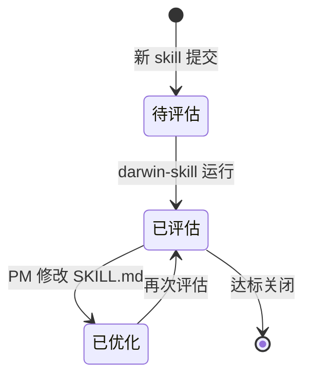

# 草图 + 交互原型联动产出示例

> 本文件是 `/pm-sketch` 的 Level 3 渐进披露资源。展示从 PMContext 到 5 类草图 + 交互原型的完整产出，覆盖 Pencil MCP、简单模式和 Scaffold 模式。

---

## 示例一：简单模式（单 HTML，无 Pencil MCP 时）

### 输入：PMContext 片段（质量看板）

```
# PMContext: Skill 质量看板

## 概述
### 问题与目标
PMSkill 项目中散落着 13 个 SKILL.md，PM 无法直观了解每个 skill 的质量水平。

## 用户场景
### 事实
- PM 是每天使用 PMSkill 的产品经理
- 场景：PM 需要知道"我的 skill 质量怎么样"
### 规则
- 看板必须从所有 `skills/*/SKILL.md` 读取数据
- 评分必须使用 darwin-skill 的 9 维 rubric（d1-d9）

## 全局约束
| 约束 | 说明 |
|------|------|
| 数据源 | results.tsv |
| 展示格式 | HTML 页面，嵌入 git 仓库直接访问 |
| 无需后端 | 纯前端方案 |
```

### 复杂度判断

| 维度 | 信号 | 结果 |
|------|------|------|
| 页面 heading 数 | 3（概述、用户场景、全局约束 + 决策日志/假设清单） | 简单信号 |
| 数据模型章节 | 有，但较短 | 简单信号 |
| 用户角色数 | 1（PM） | 简单信号 |
| state.md 节点数 | — | 未生成 |
| **结论** | **简单模式 → prototype.html** | |

### 产出物清单（`--prototype` 模式）

```
docs/pm-context/sketch/
├── ia.md           # 信息架构：Skill/Score/Bucket 实体关系
├── state.md        # 状态机：待评估→已评估→已优化
├── flow.md         # 质量评估流程：选择 skill→评分→查看短板
├── wireframe.md    # 线框：3 页布局表格
├── journey.md      # 客户旅程：跨页面/状态用户动线
└── prototype.html  # 高保真交互原型（单页 HTML，< 280KB，含 Device Toolbar + PRD Panel）
```

### 信息架构图（ia.md 片段）


### 状态机（state.md 片段）



### 交互原型特性（prototype.html）

- ✅ Device Toolbar：Desktop（1440px）/ Tablet（820px）/ Mobile（393px）三端切换
- ✅ PRD Panel：展示 PMContext 事实、规则、验收条目的侧边栏
- ✅ Design Token：所有颜色通过 CSS 变量引用，无裸 `#hex`
- ✅ 每个页面 `<section>` 含至少 1 个 JS 交互事件
- ✅ 暗色主题适配（跟随系统或 `--dark` 参数）
- ✅ 文件大小 < 280KB

---

## 示例二：Scaffold 模式（Vite 工程，无 Pencil MCP 时）

### 输入：PMContext 片段（企业采购管理系统）

```
# PMContext: 企业级采购管理系统

## 概述
（5 个采购相关页面 + 数据模型段 + 多个用户角色）

## 采购需求管理
### 事实: 需求来源包括手工录入/Excel 导入/MRP 推送
### 规则: 采购金额 ≥50000 元需 3 家比价

## 供应商管理
### 事实: 供应商状态 潜在→考察中→合格→暂停→黑名单
### 规则: 评分连续 2 次 <60 分自动降级

## 采购订单管理
### 事实: PO 可拆单、支持 ECN 变更
### 规则: ECN 累加 >20% 需重新审批

## 收货与质检
### 事实: 电子料 100% 质检，包材 AQL=0.65 抽检

## 对账与付款
### 事实: 三单匹配（PO+收货+发票）后发起付款

## 数据模型
### 核心实体关系: Department-User-PR-PO-Supplier...
```

### 复杂度判断

| 维度 | 信号 | 结果 |
|------|------|------|
| 页面 heading 数 | 6（采购需求/供应商/PO/收货/对账/用户管理） | **Scaffold 信号** |
| 数据模型章节 | 有独立「数据模型」段，含 7 个实体关系 | **Scaffold 信号** |
| 用户角色数 | 5（采购员/需求人/财务/老板/供应商） | **Scaffold 信号** |
| **结论** | **Scaffold 模式 → prototype/ 工程** | |

### 产出物清单（`--prototype` 模式）

```
docs/pm-context/sketch/
├── ia.md                   # 信息架构
├── state.md                # 状态机
├── flow.md                 # 流程图
├── wireframe.md            # 线框
└── prototype/              # Scaffold 模式工程
    ├── index.html          # Vite 入口
    ├── package.json        # React 19 + Vite 6 + Tailwind v4 + TS 5.7
    ├── vite.config.ts      # React + Tailwind 插件
    ├── tsconfig.json       # 严格模式 TS
    ├── README.md           # 本地启动说明
    └── src/
        ├── main.tsx        # ReactDOM 挂载
        ├── App.tsx         # 路由 + 工具条 + DocOverlay + PRD Panel
        ├── style.css       # @import "tailwindcss"; + Design Token
        ├── components/     # DeviceToolbar/PrdPanel/DocOverlay/Toast/Modal/PageShell
        ├── pages/          # PageHome/PageXxx... (按 PMContext 生成)
        ├── hooks/          # useHashPage.ts (对齐 Axhub)
        └── data/           # prd-data.ts/pages-config.ts/mock-data.ts
```

### prototype/src/App.tsx 入口骨架

```tsx
/**
 * @name 企业采购管理系统
 */
import { useHashPage } from './hooks/useHashPage'
import DeviceToolbar from './components/DeviceToolbar'
import PrdPanel from './components/PrdPanel'
import DocOverlay from './components/DocOverlay'
import { PAGES } from './data/pages-config'
// 各页面按需 import

export default function App() {
  const { page } = useHashPage(PAGES[0]?.id || 'home')
  return (
    <div className="min-h-screen bg-[var(--color-bg)] text-[var(--color-text)]">
      <DeviceToolbar />
      <nav className="flex gap-4 p-4 border-b border-[var(--color-border)]">
        {PAGES.map(p => (
          <a key={p.id} href={`#page=${p.id}`} className={page === p.id ? 'font-semibold text-[var(--color-primary)]' : ''}>{p.title}</a>
        ))}
      </nav>
      <main id="prototype-content" className="mx-auto max-w-7xl p-6">
        {/* 按 page 渲染对应 PageXxx 组件（L4：角色/权限/四态/错误恢复） */}
      </main>
      <PrdPanel />
      <DocOverlay />
    </div>
  )
}
```

### prototype/README.md

```markdown
# 原型预览说明

> 由 `/pm-sketch --prototype` 生成的 Scaffold 模式可交互原型（React + TS + Vite + Tailwind v4）。

## 本地启动

\`\`\`bash
npm install
npm run dev      # http://localhost:5173
npm run build    # 生产构建
npm run typecheck  # tsc --noEmit
\`\`\`

## 文件说明

| 文件/目录 | 作用 |
|----------|------|
| src/App.tsx | 主组件：路由 + 工具条 + 文档 overlay + PRD Panel |
| src/hooks/useHashPage.ts | hash 路由 hook（对齐 Axhub-Make） |
| src/components/ | DeviceToolbar/PrdPanel/DocOverlay/Toast/Modal/PageShell |
| src/pages/ | 多页面原型页面组件（L4 交互） |
| src/data/ | PRD 数据 + 页面配置 + mock 数据 |
```

---

## 9 项质量检查清单（通用）

| # | 检查项 | 通过标准 |
|---|--------|---------|
| 1 | HTML 外部依赖可控 | 有检测到技术栈时用对应 CDN 版本；新项目优先零外部依赖 |
| 2 | 响应式布局 | 移动 ≤640px / 桌面 ≥1024px |
| 3 | 图元对应 PMContext | 每个组件有来源标注 |
| 4 | [假设] 图元标注 | 灰色占位不伪装确认 |
| 5 | 交互可操作 | 点击/切换/表单 demo 级 |
| 6 | UTF-8 中文正常 | 无乱码 |
| 7 | 验收合规 | 简单模式 V1 自检 + < 280KB；Scaffold 模式 V2/V3（npm install + tsc + vite build）通过或诚实降级 |
| 8 | Mermaid 语法正确 | 节点 id 唯一无保留字 |
| 9 | 异常路径齐全 | 状态机含终态，流程含异常 |

---

## 延伸参考

- [Mermaid stateDiagram-v2 docs](https://mermaid.js.org/syntax/stateDiagram.html)
- [Mermaid flowchart docs](https://mermaid.js.org/syntax/flowchart.html)
- [交互原型设计原则](https://www.productcompass.pm/p/the-extended-opportunity-solution-tree)
- [完整模板集](prototype-templates.md)

## 实战提示

- **`--prototype` 优先于 Mermaid 盲出**：HTML 交互原型比 4 张静态图更能暴露 UX 问题
- **质量清单过一遍**：HTML 生成后逐项检查（简单模式 V1 + < 280KB；Scaffold 模式 V2/V3 验收闭环）
- **Mermaid 渲染卡顿**：节点 > 30 时拆成子图或分文件，不要硬塞一个图里
- **从 PMContext 到 HTML 映射**：页面→section，事实→table，规则→p.rule，验收→ul.acceptance
- **简单模式 vs Scaffold 模式的选择**：PMContext 页面 > 4 或含独立数据模型段时自动走 Scaffold 模式；
  也可用 `--simple` 强制简单、`--scaffold` 强制 Scaffold
- **Scaffold 模式必须验收**：生成后跑 V2/V3，失败按 V3→V2→V1 降级，不静默撒谎打 ✅
