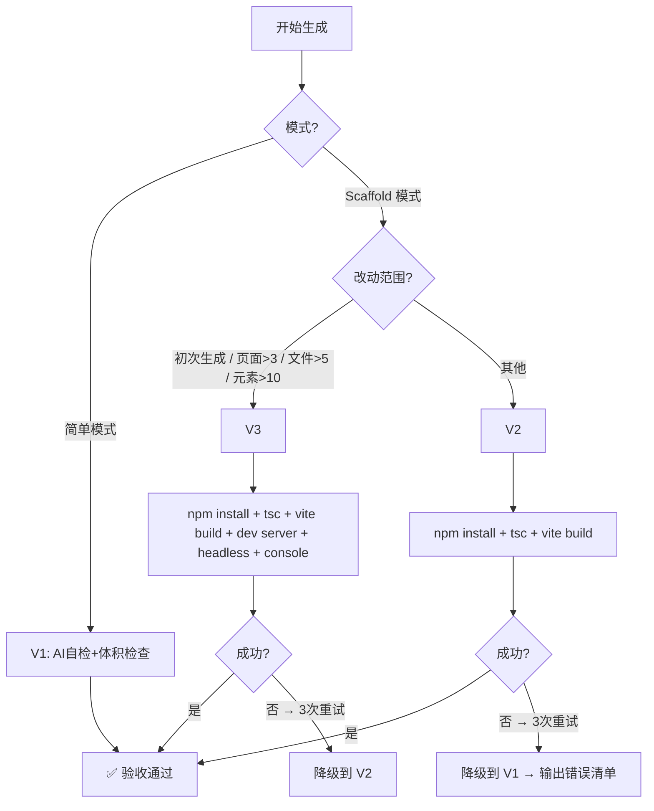

# /pm-sketch 升级技术方案

> 基于 grilling 10 项决策（CONTEXT.md `/pm-sketch 升级决策` 节），设计产物模板与验收系统。

---

## 1. 架构总览

从 PMContext + DESIGN.md（可选）到原型产物的全链路：

```text
PMContext (业务事实源)
  ├─ 页面定义、状态机、流程 → 蓝图
  ├─ 实体/字段/规则 → 数据模型
  └─ 品牌色 / 视觉线索 → DESIGN.md 锚点

DESIGN.md (视觉事实源，可选)
  └─ colors / typography / spacing / rounded → Design Token

                    ↓ Step -1 复杂度判断
                    ↓ Step 0 技术栈决策
  
         ┌─── 简单模式 (CDN HTML) ───┐
         │  < 280KB, L3, 无构建      │
         │  E1 静态嵌入               │
         │  V1 验收                   │
         └────────────────────────────┘

         ┌─── Scaffold 模式 (Vite 工程) ───┐
         │  React+TS+Tailwind v4, L4     │
         │  E1+E2 文档嵌入               │
         │  V2/V3 动态验收                │
         └─────────────────────────────────┘
```

两种模式共享的公共组件：

| 组件 | 简单模式 | Scaffold 模式 |
|------|---------|---------------|
| Device Toolbar | ✅ 内联 CSS+JS | ✅ 独立组件 |
| PRD Panel | ✅ 内联 CSS+JS | ✅ 独立组件 |
| 文档 overlay | ✅ 内联（E1） | ✅ 组件（E1）+ fetch（E2） |
| Toast / Modal | ✅ 内联 | ✅ 独立组件 |
| Design Token CSS变量 | ✅ 内联 `:root` | ✅ `style.css` + Tailwind |
| L3 路由 | ✅ hash 导航 | ✅ useHashPage hook |
| L4 多态 | — | ✅ 角色/权限/四态组件 |

---

## 2. 简单模式模板设计

### 2.1 文件形态

单 HTML 文件 `docs/pm-context/sketch/prototype.html`

### 2.2 文件结构（按出现顺序）

```
<!DOCTYPE html>
├── <head>
│   ├── meta viewport
│   ├── <title>
│   ├── CDN script tag (Vue3 or React or Plain — 按 Step 0 检测)
│   └── <style> 内联
│       ├── /* 1. Design Token — 来自 DESIGN.md 或默认 */
│       ├── /* 2. 组件样式 — 按钮/卡片/表单/导航/表格 */
│       ├── /* 3. 响应式断点 — 5 档 */
│       ├── /* 4. 暗色主题 */
│       └── /* 5. 组件覆盖 — Toast/Modal/PRD Panel/文档 overlay */
├── <body>
│   ├── <!-- Device Toolbar (1440/820/393) -->
│   ├── <!-- Document Overlay (E1 嵌入) -->
│   ├── <!-- PRD Panel -->
│   ├── <!-- Toast Container -->
│   ├── <div id="prototype-content">
│   │   └── <section id="page-xxx"> × N
│   │       ├── <h1> + 场景描述
│   │       ├── 表单/表格/列表/图表
│   │       └── 交互按钮
│   └── <script>
│       ├── /* PRD_DATA 静态嵌入 */
│       ├── /* PAGES_DATA 页面配置 */
│       ├── /* Device Toolbar JS */
│       ├── /* PRD Panel JS */
│       ├── /* 文档 overlay JS */
│       ├── /* 路由 + 交互逻辑 (L3) */
│       └── /* Toast / Modal 工具函数 */
```

### 2.3 关键约束

- 总大小 ≤ 280KB（含内联 CSS/JS/数据，不含 CDN 外部资源）
- 双击即可在浏览器打开（无需 HTTP server）
- CDN 框架版本锁定（不写 `latest`）

### 2.4 Design Token 生成规则

读取优先级（已实施，见 `prototype-templates.md` 第一节 1.1）：

1. `--design <path>` 显式指定 → 用指定路径
2. 默认检测 `docs/design/DESIGN.md` → 存在则用
3. 都不存在 → 回退 pm-sketch 自带默认 token 表

（完整派生协议见第 4 节 DESIGN.md 派生协议）

---

## 3. Scaffold 模式模板设计

### 3.1 文件形态

工程目录 `docs/pm-context/sketch/prototype/`

### 3.2 目录结构

```
prototype/
├── package.json              # 依赖：react, react-dom, vite, @vitejs/plugin-react, typescript, tailwindcss, @tailwindcss/vite
├── vite.config.ts            # Vite + React + Tailwind 插件配置
├── tsconfig.json             # 严格模式 TS 配置
├── tsconfig.app.json         # app 级 TS 配置
├── index.html                # 入口 HTML（Vite 标准入口）
├── README.md                 # 启动说明
└── src/
    ├── main.tsx              # ReactDOM.createRoot 挂载
    ├── App.tsx               # 主组件：路由 + 工具条 + 文档 overlay + PRD Panel
    ├── style.css             # @import "tailwindcss"; + Design Token CSS 变量
    ├── components/
    │   ├── DeviceToolbar.tsx  # 三端切换
    │   ├── PrdPanel.tsx      # PRD 批注面板
    │   ├── DocOverlay.tsx    # 文档预览 overlay
    │   ├── Toast.tsx         # 通知组件
    │   ├── Modal.tsx         # 弹窗组件
    │   └── PageShell.tsx     # 页面级骨架（导航+角色帽+面包屑）
    ├── pages/
    │   ├── PageHome.tsx      # 首页（按 PMContext 页面定义生成）
    │   ├── PageXxx.tsx       # 其余页面 × N
    │   └── ...
    ├── hooks/
    │   └── useHashPage.ts   # hash 路由 hook（对齐 Axhub）
    ├── data/
    │   ├── prd-data.ts      # PMContext 序列化数据（E1）
    │   ├── pages-config.ts  # 页面配置列表
    │   └── mock-data.ts     # 表格/图表 mock 数据
    └── assets/               # 原型专属图片/资源
```

### 3.3 各文件模板

#### `package.json`

```json
{
  "name": "prototype-{需求名}",
  "private": true,
  "version": "0.0.0",
  "type": "module",
  "scripts": {
    "dev": "vite",
    "build": "tsc -b && vite build",
    "preview": "vite preview"
  },
  "dependencies": {
    "react": "^19.0.0",
    "react-dom": "^19.0.0"
  },
  "devDependencies": {
    "@tailwindcss/vite": "^4.0.0",
    "@types/react": "^19.0.0",
    "@types/react-dom": "^19.0.0",
    "@vitejs/plugin-react": "^4.0.0",
    "tailwindcss": "^4.0.0",
    "typescript": "^5.7.0",
    "vite": "^6.0.0"
  }
}
```

> 版本号用 `^` 范围，随 npm 解析最新兼容版本。不锁定 patch。

#### `vite.config.ts`

```ts
import { defineConfig } from 'vite'
import react from '@vitejs/plugin-react'
import tailwindcss from '@tailwindcss/vite'

export default defineConfig({
  plugins: [react(), tailwindcss()],
  base: './',   // 支持 file:// 协议直接打开
})
```

#### `tsconfig.json`

```json
{
  "compilerOptions": {
    "target": "ES2020",
    "useDefineForClassFields": true,
    "lib": ["ES2020", "DOM", "DOM.Iterable"],
    "module": "ESNext",
    "skipLibCheck": true,
    "moduleResolution": "bundler",
    "allowImportingTsExtensions": true,
    "isolatedModules": true,
    "moduleDetection": "force",
    "noEmit": true,
    "jsx": "react-jsx",
    "strict": true,
    "noUnusedLocals": false,
    "noUnusedParameters": false,
    "noFallthroughCasesInSwitch": true,
    "forceConsistentCasingInFileNames": true
  },
  "include": ["src"]
}
```

#### `index.html`

```html
<!DOCTYPE html>
<html lang="zh-CN">
  <head>
    <meta charset="UTF-8" />
    <meta name="viewport" content="width=device-width, initial-scale=1.0" />
    <title>原型: {{PROJECT_NAME}}</title>
    <link rel="stylesheet" href="/src/style.css" />
  </head>
  <body>
    <div id="root"></div>
    <script type="module" src="/src/main.tsx"></script>
  </body>
</html>
```

#### `src/main.tsx`

```tsx
import { StrictMode } from 'react'
import { createRoot } from 'react-dom/client'
import App from './App'
import './style.css'

createRoot(document.getElementById('root')!).render(
  <StrictMode>
    <App />
  </StrictMode>
)
```

#### `src/style.css`

```css
@import "tailwindcss";

/* === Design Token — 来自 DESIGN.md 或默认 === */
:root {
  /* 以下为生成时代入的 token 占位 */
  --color-primary: {{COLOR_PRIMARY}};
  /* ... 完整 token 表由 DESIGN.md 派生协议生成 ... */
}
```

#### `src/hooks/useHashPage.ts`

直接对齐 Axhub-Make `src/common/useHashPage.ts` 接口：

```ts
import { useState, useCallback, useEffect } from 'react'

export function useHashPage(defaultPage: string) {
  const [page, setPageState] = useState(defaultPage)

  useEffect(() => {
    const onHashChange = () => {
      const hash = window.location.hash.replace(/^#page=/, '')
      setPageState(hash || defaultPage)
    }
    window.addEventListener('hashchange', onHashChange)
    onHashChange()
    return () => window.removeEventListener('hashchange', onHashChange)
  }, [defaultPage])

  const setPage = useCallback((id: string) => {
    window.location.hash = `#page=${id}`
  }, [])

  return { page, setPage }
}
```

#### `src/App.tsx` — 骨架

```tsx
import { useHashPage } from './hooks/useHashPage'
import DeviceToolbar from './components/DeviceToolbar'
import PrdPanel from './components/PrdPanel'
import DocOverlay from './components/DocOverlay'
import { PAGES } from './data/pages-config'
// pages 按需 import

export default function App() {
  const { page, setPage } = useHashPage(PAGES[0]?.id || 'home')

  return (
    <div className="min-h-screen bg-[var(--color-bg)] text-[var(--color-text)]">
      <DeviceToolbar />
      {/* 导航（按页面数量自动选 hamburger 或 inline） */}
      <nav>...</nav>
      <main id="prototype-content" className="mx-auto transition-all">
        {page === 'home'  && <PageHome  />}
        {page === 'xxx'   && <PageXxx   />}
        {/* 其余页面按需渲染 */}
      </main>
      <PrdPanel />
      <DocOverlay />
    </div>
  )
}
```

#### `src/components/DeviceToolbar.tsx`

与现有简单模式 Device Toolbar 同功能，但转为 React 组件 + Tailwind 类。

#### `src/components/PrdPanel.tsx`

同上，PRD Panel 转为 React 组件，数据从 `prd-data.ts` 读取。

#### `src/components/DocOverlay.tsx`

E1 模式：从 `prd-data.ts` 读取嵌入的文档原文，在 overlay 中渲染。
E2 模式（可选）：运行时 `fetch('./pm-context.md')` 动态加载。

#### `src/pages/PageXxx.tsx` — 页面组件骨架

```tsx
import { useState } from 'react'

export default function PageHome() {
  // L3: 表单状态 + 导航到下一页
  const [formData, setFormData] = useState({ ... })
  
  return (
    <section className="p-6 space-y-6">
      <h1 className="text-2xl font-semibold">页面标题</h1>
      {/* 表单/表格/卡片内容 */}
      {/* 交互按钮 */}
    </section>
  )
}
```

L4 增强：加入 `useEffect` 模拟加载态 + 错误态 + 空态 + 成功态四种渲染分支。

---

## 4. DESIGN.md 派生 Token 协议

### 4.1 扫描路径

1. 用户通过 `--design <path>` 指定 → 用指定路径
2. 默认检测 `docs/design/DESIGN.md` → 存在则用
3. 都不存在 → 回退 pm-sketch 自带默认 token 表

### 4.2 映射规则

DESIGN.md 采用与 Axhub-Make `theme-guide.md` 对齐的结构，字段映射：

| DESIGN.md 字段 | CSS 变量 | 默认值 |
|---------------|---------|--------|
| `colors.primary` | `--color-primary` | `#2563eb` |
| `colors.ink` | `--color-text` | `#1f2937` |
| `colors.ink-muted` | `--color-text-secondary` | `#6b7280` |
| `colors.ink-subtle` | `--color-text-muted` | `#9ca3af` |
| `colors.canvas` | `--color-bg` | `#ffffff` |
| `colors.surface-1` | `--color-bg-secondary` | `#f9fafb` |
| `colors.surface-2` | `--color-bg-tertiary` | `#f3f4f6` |
| `colors.hairline` | `--color-border` | `#e5e7eb` |
| `colors.success` | `--color-success` | `#10b981` |
| `colors.warning` | `--color-warning` | `#f59e0b` |
| `colors.danger` | `--color-error` | `#ef4444` |
| `colors.info` | `--color-info` | `#3b82f6` |
| `spacing.xxs` | `--space-xs` | `4px` |
| `spacing.xs` | `--space-sm` | `8px` |
| `spacing.md` | `--space-md` | `16px` |
| `spacing.lg` | `--space-lg` | `24px` |
| `spacing.xl` | `--space-xl` | `32px` |
| `spacing.xxl` | `--space-2xl` | `48px` |
| `rounded.xs` | `--radius-xs` | `2px` |
| `rounded.sm` | `--radius-sm` | `4px` |
| `rounded.md` | `--radius-md` | `8px` |
| `rounded.lg` | `--radius-lg` | `12px` |
| `rounded.xl` | `--radius-xl` | `16px` |
| `typography.body.fontSize` | `--font-size-base` | `1rem` |
| `typography.body-sm.fontSize` | `--font-size-sm` | `0.875rem` |
| `typography.body-lg.fontSize` | `--font-size-lg` | `1.125rem` |
| `typography.body.fontFamily` | `--font-sans` | `-apple-system, ...` |
| `typography.mono.fontFamily` | `--font-mono` | `SF Mono, ...` |

### 4.3 缺失字段处理

- 如果 DESIGN.md 存在但 `colors.primary` 缺失 → 使用默认 `#2563eb`，在 token 表注释中标 `[假设]`
- 如果 DESIGN.md 存在但全无 `typography` 节 → typography 全部回退默认
- `rounded` / `spacing` 同上逐字段回退原则

### 4.4 冲突处理

PMContext 中提到的品牌色与 DESIGN.md 不一致 → 两个 token 都写入，但 `--color-primary` 使用 DESIGN.md 值（视觉事实源优先），PMContext 值写入 `--color-primary-alt` 并在旁边标 `/* [冲突] PMContext: #xxx */`

---

## 5. 文档 Overlay 实现

### 5.1 简单模式（E1 强制）

```javascript
// 在 <script> 中内联
window.DOC_DATA = {
  pmContext: "## 概述\n...全文...",
  designMd: "## Colors\n...全文...",
  documentTree: [
    { name: "pm-context.md", type: "business", content: "..." },
    { name: "DESIGN.md", type: "design", content: "..." }
  ]
}
```

Overlay 渲染逻辑：
- 点击「📄 文档」按钮 → 显示半透明 overlay
- 左侧 200px 文件树（区分业务/视觉两区）
- 右侧 `<pre>` 渲染选中的 Markdown 原文
- 关闭按钮 / 点击背景关闭

### 5.2 Scaffold 模式

#### E1（默认）

与简单模式相同的数据结构，但放在 `src/data/prd-data.ts` 中作为模块导出，`DocOverlay.tsx` 组件 import 使用。

#### E2（V3 验收可选）

在 `vite.config.ts` 中配置 `publicDir`，将 `docs/pm-context/pm-context.md` 和 `docs/design/DESIGN.md` 复制到 `public/` 目录：

```ts
// vite.config.ts 仅在 E2 模式下添加
import { copyFileSync } from 'fs'
// 在 build 前或 dev server 启动前将 .md 文件复制到 public/
```

`DocOverlay.tsx` 回退逻辑：

```tsx
const [content, setContent] = useState<string | null>(null)

useEffect(() => {
  // 先尝试 E2 fetch
  fetch('./pm-context.md')
    .then(r => r.text())
    .then(setContent)
    .catch(() => {
      // fetch 失败 → 回退 E1 静态数据
      setContent(EMBEDDED_PM_CONTEXT)
    })
}, [])
```

### 5.3 Markdown 渲染

两个模式均使用 **不依赖外部库的轻量渲染**：

```javascript
function renderMarkdown(md) {
  // 仅支持：## heading, **bold**, - list, `code`, 段落
  // 不依赖 marked / remark 等外部库
  return md
    .replace(/^### (.+)$/gm, '<h3>$1</h3>')
    .replace(/^## (.+)$/gm, '<h2>$1</h2>')
    .replace(/^# (.+)$/gm, '<h1>$1</h1>')
    .replace(/\*\*(.+?)\*\*/g, '<strong>$1</strong>')
    .replace(/`(.+?)`/g, '<code>$1</code>')
    .replace(/^- (.+)$/gm, '<li>$1</li>')
    .replace(/\n\n/g, '</p><p>')
    .replace(/^([^<].+)$/gm, '<p>$1</p>')
}
```

---

## 6. 响应式断点系统

### 6.1 5 档断点定义

```css
/* 参考: 档位继承自 Axhub-Make + Linear DESIGN.md */

/* 断点变量（仅参考，CSS 变量不参与 media query，这里用注释说明）:
   Desktop-XL: ≥ 1440px
   Desktop:    1280px – 1439px
   Tablet:     1024px – 1279px
   Mobile-Lg:  768px  – 1023px
   Mobile:     < 768px
*/

/* Desktop-XL (≥ 1440px) — 默认布局，不写 media query */
/* Desktop (1280px–1439px) — 稍有缩窄，布局不变 */
@media (max-width: 1439px) { }

/* Tablet (1024px–1279px) — 3→2列，导航不变 */
@media (max-width: 1279px) {
  .grid-3 { grid-template-columns: repeat(2, 1fr); }
}

/* Mobile-Lg (768px–1023px) — 2→1列，导航 hamburger */
@media (max-width: 1023px) {
  .grid-3 { grid-template-columns: 1fr; }
  nav.inline { display: none; }
  nav.hamburger { display: flex; }
}

/* Mobile (< 768px) — 单列，display 字号缩小，touch target 增大 */
@media (max-width: 767px) {
  h1 { font-size: clamp(1.5rem, 5vw, 2rem); }
}
```

### 6.2 Tailwind v4 适配（Scaffold 模式）

Tailwind v4 已内建 `sm:` / `md:` / `lg:` / `xl:` / `2xl:` 断点，对应关系：

| Tailwind 断点 | 最小宽度 | 用途 |
|--------------|---------|------|
| `sm:` | 640px | 手机 |
| `md:` | 768px | 手机横屏 / 小平板 |
| `lg:` | 1024px | 平板 |
| `xl:` | 1280px | 桌面 |
| `2xl:` | 1536px | 大屏桌面 |

Scaffold 模式使用 Tailwind 响应式前缀，简单模式使用手写 `@media`。

---

## 7. 验收系统实现

### 7.1 验收级别判定



### 7.2 V2 验收脚本（Shell 伪代码）

```bash
cd "$PROTOTYPE_DIR"
npm install 2>&1 || exit 1
npx tsc --noEmit 2>&1 || exit 2
npx vite build 2>&1 || exit 3
echo "✅ V2 验收通过"
```

### 7.3 V3 验收脚本

```bash
cd "$PROTOTYPE_DIR"
npm install 2>&1 || exit 1
npx tsc --noEmit 2>&1 || exit 2
npx vite build 2>&1 || exit 3

# 启动 dev server 后台
npx vite --port 4173 &
VITE_PID=$!
sleep 3

# 检查端口是否响应
curl -s -o /dev/null -w "%{http_code}" http://localhost:4173 || exit 4

# 如果有 headless 浏览器，加载页面查 console 错误
if command -v chromium &> /dev/null; then
  chromium --headless --no-sandbox --dump-dom http://localhost:4173 2>&1 \
    | grep -i "error\|uncaught\|exception" && exit 5
fi

kill $VITE_PID 2>/dev/null
echo "✅ V3 验收通过"
```

### 7.4 V3 环境检测

V3 执行前先检测环境是否具备条件：

```bash
has_chrome=false
command -v chromium &>/dev/null && has_chrome=true
command -v google-chrome &>/dev/null && has_chrome=true
command -v curl &>/dev/null || exit "❌ V3 需要 curl"

# 若没有 headless 浏览器，跳过 console 检查，只做端到端可达性验证
```

### 7.5 降级输出格式

```markdown
# ⚠️ 原型未验收 — 错误清单

> 验收流程: V3 → V2 → V1，各级均失败后降级输出

## 错误详情

| 步骤 | 状态 | 错误信息 |
|------|------|---------|
| npm install | ❌ | 依赖解析失败: xxx |
| tsc --noEmit | — | 未执行（前置失败） |
| vite build | — | 未执行（前置失败） |

## 已知问题

- 依赖 xxx 版本不兼容，建议手动检查 package.json
- 生成的文件已落盘至 `docs/pm-context/sketch/prototype/`，修复上述问题后可手动执行 `npm install && npm run build`

## 影响评估

- 简单演示: 部分可用（直接双击 index.html 查看基础布局）
- 完整功能: 不可用（需要修复构建问题）
```

---

## 8. 反例黑名单（新增）

在现有 SKILL.md 反例黑名单基础上追加：

| 反模式 | 为什么不要做 |
|--------|------------|
| Scaffold 模式生成后不运行验收即打 ✅ 标记完成 | 系统性撒谎——PM 拿到一个 `npm install` 都跑不起来的工程，毁信任 |
| 简单模式 HTML > 280KB 不拆分不提示 | 体积门是质量底线，超限静默输出等于隐藏已知缺陷 |
| Scaffold 模式没有 package.json / vite.config.ts 就输出".tsx"文件 | 与工程脚手架承诺不符，用户拿到的是不可运行的碎片 |
| 简单模式和 Scaffold 模式共用同一套 Design Token 模板 | 两个模式的 token 引入方式不同（inline vs CSS file + Tailwind），混用导致 Scaffold 工程出现 CDN script tag |
| V3 验收失败后直接跳过不降级（静默改打 ✅） | 与降级链契约矛盾，v3 失败应诚实降级，不得撒谎 |

---

## 9. AI 生成约束

### 9.1 模板变量占位符

`prototype-templates.md` 中使用 `{{VARIABLE_NAME}}` 占位，AI 生成时替换：

| 占位符 | 来源 | 说明 |
|--------|------|------|
| `{{PROJECT_NAME}}` | PMContext 标题 | 原型标题 |
| `{{COLOR_PRIMARY}}` | DESIGN.md / 默认 | 品牌主色 |
| `{{PAGES_DATA}}` | PMContext 页面定义 | JS 数组，含页面 title/字段/规则/验收 |
| `{{PRD_DATA}}` | PMContext + PRD 文件 | PRD Panel 数据 |
| `{{DOC_DATA}}` | PMContext + DESIGN.md 原文 | 文档 overlay 数据 |
| `{{STATE_MACHINE}}` | PMContext 状态转移 | 状态机数据（L3/L4 交互用） |
| `{{MOCK_DATA}}` | 数据模型推断 | 表格/图表 mock |

### 9.2 模板选择流程

```text
1. 执行 Step -1 复杂度判断 → 确定简单/Scaffold 模式
2. 执行 Step 0 技术栈决策：
   - 简单模式 → 检测/推荐 Vue3/React/Plain
   - Scaffold 模式 → 固定 React + TS + Vite + Tailwind v4
3. 执行 DESIGN.md 扫描 → 派生 token 表
4. 根据模式选择对应模板节：
   - 简单模式 → 「简单模式完整模板」节
   - Scaffold 模式 → 逐文件生成「Scaffold 模式模板」节中各文件
5. 填写占位符 → 生成产物
6. 执行验收（按 Acceptance Tier）
```

---

## 10. 质量清单（分模式）

### 10.1 简单模式

- [ ] ✅ 单 HTML < 280KB
- [ ] ✅ 双击可打开（无跨域/CORS 问题）
- [ ] ✅ 使用 CDN 框架（检测/推荐的版本）
- [ ] ✅ Design Token CSS 变量（无裸 `#hex`）
- [ ] ✅ 5 档响应式断点
- [ ] ✅ Device Toolbar 三端切换
- [ ] ✅ PRD Panel 展示批注
- [ ] ✅ 文档 overlay 可展开查看 PMContext
- [ ] ✅ 每个 `<section>` 至少 1 个 JS 交互
- [ ] ✅ 暗色主题适配
- [ ] ✅ V1 自检通过

### 10.2 Scaffold 模式

- [ ] ✅ 目录结构对齐 Q9 约定
- [ ] ✅ package.json 包含所有必要依赖
- [ ] ✅ Vite + React + TS + Tailwind v4 配置完整
- [ ] ✅ Design Token 在 `style.css` 中（Tailwind `@import` 之后）
- [ ] ✅ 5 档断点（Tailwind 响应式前缀）
- [ ] ✅ Device Toolbar + PRD Panel + 文档 overlay 三组件完整
- [ ] ✅ 多页 hash 路由（useHashPage hook）
- [ ] ✅ L4 交互：角色/权限/四态（加载/空/成功/错误）
- [ ] ✅ 所有 `<section>` 对应 PMContext 页面定义
- [ ] ✅ `README.md` 含本地启动命令
- [ ] ✅ V2/V3 验收通过或诚实降级
