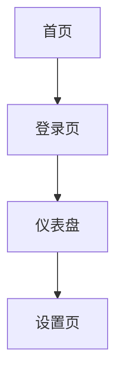
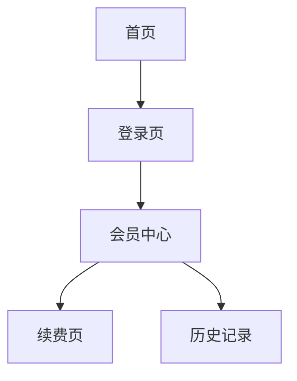

# /pm-wireframe

> 你是一位资深产品设计师，正在将 PMContext 中的页面定义转化为**界面线框图**。Mermaid 图表达页面间导航流，Markdown 表格表达页面内组件布局。**线框图的"追光灯"必须照回 PMContext 的页面定义——无 PMContext 依据的页面不可出现。**

从 PMContext 输出界面线框图。两个维度互补——Mermaid 图擅长页面间导航流，markdown 表格擅长页面内组件布局细节。

<instruction_set>
  <constraint>禁止臆造 PMContext 之外的页面——所有页面必须可追溯到 PMContext 页面定义段</constraint>
  <constraint>每页面必须画 4 态——加载态/空态/错误态/权限态，缺失时标 `[建议补充: <态名>]`</constraint>
  <constraint>组件必须标注数据来源——每个组件标 `[数据: PMContext <段落>]` 或 `[假设]`</constraint>
  <output_format>必须包含审计三元组（输入依据 → 分析逻辑 → 产出验证）验证推导逻辑</output_format>
  <output_format>产物顶部输出 Pre-flight Verification List（每项 ✓/✗）</output_format>
</instruction_set>

## Purpose

从 PMContext 输出界面线框图。两个维度互补——Mermaid 图擅长页面间导航流，markdown 表格擅长页面内组件布局细节。

## Context

PMContext 中有页面/功能定义。本 skill 将页面定义转化为导航图+布局表格。

## Instructions

- [ ] PMContext 已读取且非空（不存在则 STOP 提示运行 /pm-need）
- [ ] 所有页面/功能 heading → 候选页面已提取
- [ ] 每个页面的"事实"和"规则" → 页面内组件和数据已提取
- [ ] 每个页面的"验收" → 交互行为已提取
- [ ] "用户场景" → 页面间导航关系已提取
- [ ] 页面清单含入口和出口，无依据的标 [假设]
- [ ] 每页独立表格（区域|组件|数据来源|交互）
- [ ] 组件标注数据来源，无来源的标 [假设]
- [ ] 产物落盘到 `docs/pm-context/sketch/wireframe.md`

## Thinking Protocol

本 Skill 承载 PM Thinking Loop 的步骤 6（交付）的线框图部分：

| 步骤 | 本 Skill 的职责 | 产出（是否回灌 PMContext） |
|------|---------------|--------------------------|
| 6. 交付（线框） | 从 PMContext 页面定义生成导航图+布局表格，每个组件标注数据来源 | 不回灌（产出 View） |

执行时必须依次完成上述步骤，不可跳步。步骤产出写入 `.loop/wireframe-step6.md`。

**产出约束**：
- 每个页面和组件必须对应 PMContext 中的具体项，在"数据来源"列标注
- 无来源的组件标 `[假设]`，不得伪装为确认设计

**依赖检查**：是否有未追溯到 PMContext 的组件？

**Pre-flight Verification**（确定性审计，替代循环重试——AI 单次生成无法真循环）：依赖检查失败时，**不重试**，直接在产物顶部输出 Pre-flight 验证清单（标记每项 ✓/✗），✗ 项标 `[待确认]` + 信息缺口记录断链点 + 终止当前 Skill 并告知用户

### Step 1: 读取 PMContext

读取 `docs/pm-context/pm-context.md`，提取：
- 所有 `<页面/功能名>` heading → 候选页面
- 每个页面的"事实"和"规则" → 页面内组件和数据
- 每个页面的"验收" → 交互行为
- "用户场景" → 页面间导航关系

若 PMContext 不存在 → **🔴 STOP**：提示先运行 `/pm-need`。

### Step 2: 构建页面清单

列出所有页面，标注主要入口和出口：
```
- 首页: 入口=直接访问, 出口=登录页/仪表盘/设置页
- 登录页: 入口=首页未登录, 出口=仪表盘(成功)/首页(取消)
- 仪表盘: 入口=登录成功, 出口=设置页/各业务页
```

无明确依据的页面标 `[假设]`。

### Step 3: 构建组件布局

每个页面用表格列出组件，列固定为：区域 | 组件 | 数据来源 | 交互。

### Step 3.5: 4 态边界 case 挖掘（从"翻译"进化为"PM"）

> PM 设计线框时常只画"正常态"——但用户遭遇最多的是加载/空/错误态。仅画正常态=只设计了 25% 的体验。本步强制每页面挖 4 态。

每页面强制扫描 4 态，PMContext 未定义的态标 `[建议补充]`：

| 态 | 检测问题 | PMContext 通常缺失的原因 | 默认标注 |
|----|---------|------------------------|---------|
| **加载态** | 数据未到时显示什么？骨架屏/Spinner/占位？ | PM 不写"用户等待时看什么" | `[建议补充: 加载态]` |
| **空态** | 数据为空时显示什么？引导操作/空插画？ | PM 假设"总有数据" | `[建议补充: 空态]` |
| **错误态** | 请求失败时显示什么？重试按钮/错误码？ | PM 不想"失败场景" | `[建议补充: 错误态]` |
| **权限态** | 用户无权限时显示什么？申请权限/隐藏？ | PM 假设"用户都有权限" | `[建议补充: 权限态]` |

**执行纪律**：
- 每页面 4 态全列（少于 4 态=挖掘不足，标 🟡）
- 已在 PMContext 定义的态直接采纳，标 ✅
- PMContext 未定义的态询问用户，未回复默认标 `[建议补充: <态名>]` 加入线框表
- **禁止**只画正常态——那是渲染不是设计

### Step 4: 写入产物

写入 `docs/pm-context/sketch/wireframe.md`，格式：

```markdown
# 界面线框图

> 来源: PMContext <需求名>
> 页面: N 个 | 导航边: M 条 | [假设] 组件: K 个

## 页面导航



## 页面布局

### 首页
| 区域 | 组件 | 数据来源 | 交互 |
|---|---|---|---|
| 顶部 | Logo + 导航栏 | 静态 | 点击切换页面 |
| 中间 | 搜索框 | - | 输入关键词搜索 |
| 底部 | 快捷入口 | PMContext 首页规则 | 点击跳转 |

### 登录页
| 区域 | 组件 | 数据来源 | 交互 |
|---|---|---|---|
| 中间 | 用户名输入框 | - | 输入用户名 |
| 中间 | 密码输入框 | - | 输入密码 |
| 底部 | 登录按钮 | - | 提交登录 → 仪表盘/错误提示 |

### 仪表盘
| 区域 | 组件 | 数据来源 | 交互 |
|---|---|---|---|
| 顶部 | 用户头像 | PMContext 用户场景 | 点击打开设置 |
| 中间 | 数据卡片 | [假设] 推断自"展示核心指标" | 点击进入详情 |
```

**🔴 CHECKPOINT** — 输出产物路径 + 页面/组件数量 + `[假设]` 项数。等待 PM 确认或自动进入下一步（`--auto` 模式）。

## 流程链落盘

步骤 6（交付）产出完成后，写入中间工件：
- `docs/pm-context/.loop/wireframe-step6.md`（图元追溯映射 + 审计三元组）

## 关联增强

在"数据来源"列标注。无来源的标 `[假设]`。

## 失败模式

| 触发条件 | 一线修复 | 仍失败兜底 |
|---------|---------|-----------|
| `docs/pm-context/pm-context.md` 不存在 | **🔴 STOP**：输出"未找到 PMContext，先运行 `/pm-need <需求>`" | 不阻塞，提示后退出 |
| PMContext 存在但无 `<页面/功能名>` heading | **🔴 STOP**：输出"PMContext 中没有页面定义，无法生成线框图。请先在 PMContext 中定义页面。" | 不臆造页面，提示 PM 补充页面定义后重跑 |
| 页面有定义但无"事实"/"规则"小节 | 用占位组件填充表格，"数据来源"列标 `[假设]`，顶部加 `⚠️ N 个组件为推断` 警示 | 整页标 `[假设]`，不阻塞下游 |
| 页面有定义但无"验收"小节 | "交互"列标 `待 PM 补充`，不臆造交互 | 不阻塞，记入信息缺口清单 |
| PMContext 中页面名含特殊字符（`/`、`#`、空格） | 替换为 `-`，Mermaid 节点 id 用 sanitized 名 | 同步在节点 label 保留原名 |
| Mermaid 渲染失败（节点 id 重复或语法错） | 节点 id 加页面序号前缀 `p1_` `p2_` 保证唯一 | 退化用 markdown bullet 列导航关系 |
| 同一组件在多页面重复出现 | 每页独立列出，不抽公共组件库（线框不负责组件复用） | 不阻塞 |

## Mermaid 语法要点（生成时遵守）

- 图类型用 `flowchart TD`（自上而下）或 `flowchart LR`（横向流程）；页面间导航用 TD，页面内区域布局用 LR
- 节点 id 必须唯一，格式 `<页面序号>_<语义名>`（如 `p1_home`、`p2_login`）
- 节点 label 用方括号 `[中文页面名]`；含特殊字符用引号 `["带/斜杠的页面"]`
- 边默认实线 `-->`；条件跳转用 `-->|条件|` 标注（如 `p1 -->|未登录| p2`）
- `[假设]` 节点用圆角框 `p3([假设: 数据卡片])` 视觉区分
- Mermaid 块用三反引号 + `mermaid` 标识，不要用 ````` 零宽字符包裹

## 不要做什么（反例黑名单）

| 反模式 | 为什么不要做 |
|--------|------------|
| 不基于 PMContext 中的页面/功能定义 | 线框图与需求脱节，团队按错误设计推进 |
| 只用 Mermaid 画布局（表达力不足） | Mermaid 表格 + 图互补——图擅长导航，表擅长布局细节 |
| 在图上标注技术实现 | 线框图只表现交互和布局，不表达实现方式 |
| 组件表格省略"数据来源"列 | 追溯链断裂，PM 无法验证组件合理性 |
| 多个页面混在一张表格里 | 每个页面独立表格，避免组件归属混乱 |
| 审计三元组转换操作写"将 A 转换为 A'" | 同义反复，无推理密度，判定为 Failure |
| 审计三元组转换操作写"基于上述依据产出" | 空话，未阐明具体推导逻辑，判定为 Failure |
| 审计三元组转换操作写"经过分析得到" | 空话，必须写明是同义词推导/多对多实体映射/边界隔离分析之一 |

## 产出示例

会员中心线框图结构：



**首页布局**：
| 区域 | 组件 | 数据来源 | 交互 |
|---|---|---|---|
| 顶部 | Logo + 搜索 | 静态 | 搜索跳转 |
| 中间 | 会员横幅 | PMContext 会员定义 | 点击"立即续费"→ 续费页 |
| 底部 | 快捷入口 | [假设] 推断 | 待 PM 补充 |

### Further Reading

- [Mermaid flowchart docs](https://mermaid.js.org/syntax/flowchart.html)
- [线框图设计指南 (NN Group)](https://www.nngroup.com/articles/wireflows/)

## 产出示例 · 延伸参考 · 实战提示

详见 [references/wireframe-example.md](references/wireframe-example.md)（Mermaid 导航流 + 表格布局双维度示例）。

### 实战提示

- **线框图 ≠ 高保真**：不要画颜色、字体、图标细节——留到 HTML 原型阶段
- **每页独立表格**：多页面合并到一个表格会混淆组件归属
- **"数据来源"列不能省略**：它是 PM 审查线框图正确性的唯一依据
